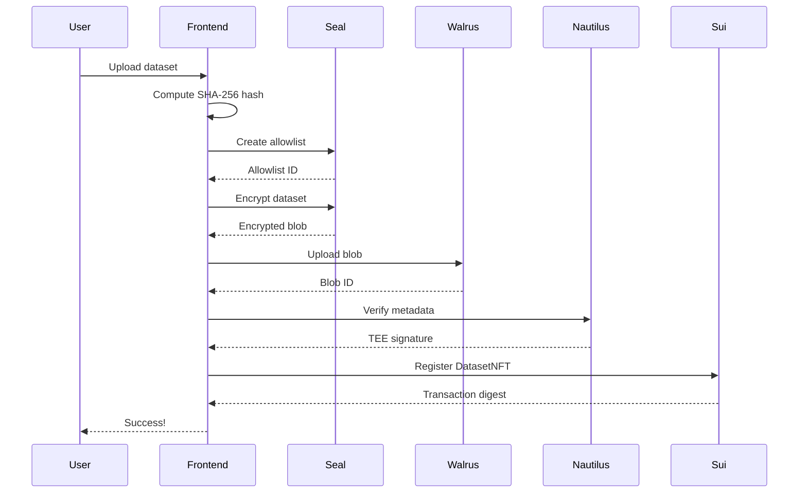
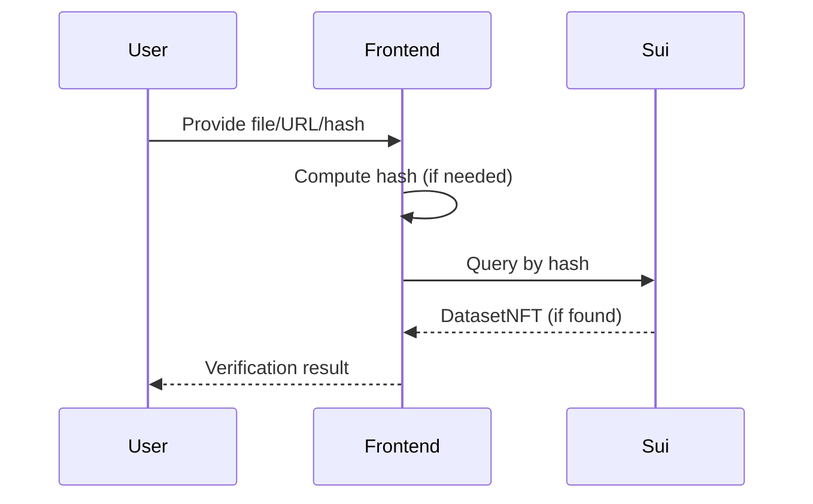
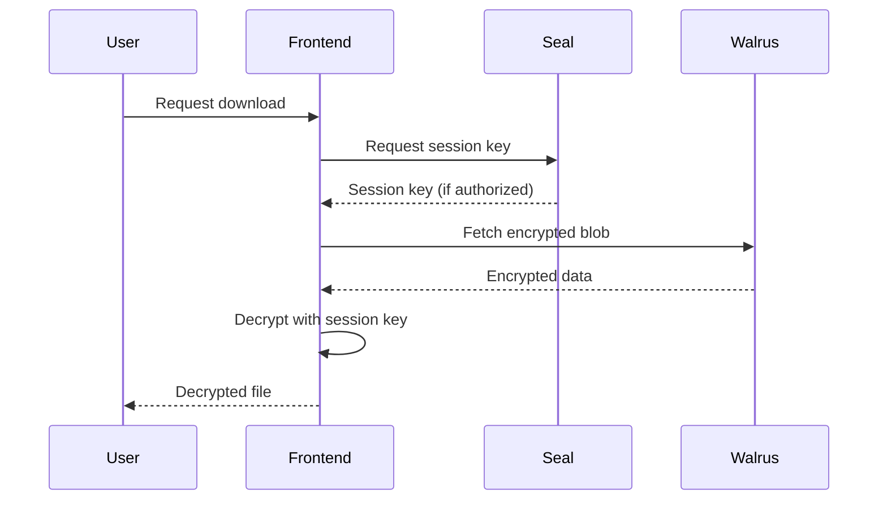

# Architecture Overview

SealTrust combines multiple technologies to provide secure, verifiable dataset storage.

## System Architecture

```
┌─────────────────────────────────────────────────────────────────┐
│                        SealTrust Platform                        │
├─────────────────────────────────────────────────────────────────┤
│                                                                  │
│  ┌──────────────┐    ┌──────────────┐    ┌──────────────┐      │
│  │   Frontend   │───▶│   Nautilus   │───▶│     Sui      │      │
│  │   (Next.js)  │    │    (TEE)     │    │  Blockchain  │      │
│  └──────────────┘    └──────────────┘    └──────────────┘      │
│         │                   │                    │              │
│         │                   │                    │              │
│         ▼                   ▼                    ▼              │
│  ┌──────────────┐    ┌──────────────┐    ┌──────────────┐      │
│  │    Walrus    │    │     Seal     │    │  DatasetNFT  │      │
│  │   Storage    │    │  Encryption  │    │   Registry   │      │
│  └──────────────┘    └──────────────┘    └──────────────┘      │
│                                                                  │
└─────────────────────────────────────────────────────────────────┘
```

## Core Components

### 1. Sui Blockchain

The foundation layer providing:

- **Smart Contracts** - Move language contracts for dataset registration
- **DatasetNFT** - Immutable on-chain records of verified datasets
- **Object Model** - Unique object IDs for datasets and capabilities

### 2. Walrus Storage

Decentralized blob storage for encrypted datasets:

- **Distributed** - Data replicated across multiple nodes
- **Persistent** - Configurable storage epochs
- **Efficient** - Erasure coding for reliability

### 3. Seal Encryption

Threshold encryption for access control:

- **Allowlist-based** - Fine-grained access permissions
- **Session Keys** - Time-limited decryption capabilities
- **Key Servers** - Distributed key management

### 4. Nautilus TEE

Trusted Execution Environment for verification:

- **AWS Nitro Enclaves** - Hardware-isolated execution
- **Attestation** - Cryptographic proof of enclave integrity
- **Signature** - TEE-signed verification proofs

## Data Flow

### Registration Flow



### Verification Flow



### Download Flow



## Security Model

### Integrity

- SHA-256 hash computed on original data
- Hash stored immutably on Sui blockchain
- TEE attestation provides additional trust

### Confidentiality

- Data encrypted before storage
- Seal threshold encryption
- Only authorized addresses can decrypt

### Availability

- Walrus distributed storage
- Multiple storage epochs
- Redundant key servers

## Smart Contract Architecture

```move
module app::sealtrust {
    /// DatasetNFT - The on-chain record of a verified dataset
    public struct DatasetNFT has key, store {
        id: UID,
        name: vector<u8>,
        description: vector<u8>,
        format: vector<u8>,
        size: u64,
        original_hash: vector<u8>,      // SHA-256 hash
        walrus_blob_id: vector<u8>,     // Encrypted storage location
        seal_policy_id: vector<u8>,     // Access control policy
        verification_timestamp: u64,
        owner: address,
        enclave_signature: vector<u8>,  // TEE attestation
    }
}
```

See [Smart Contracts](/contracts) for detailed documentation.
