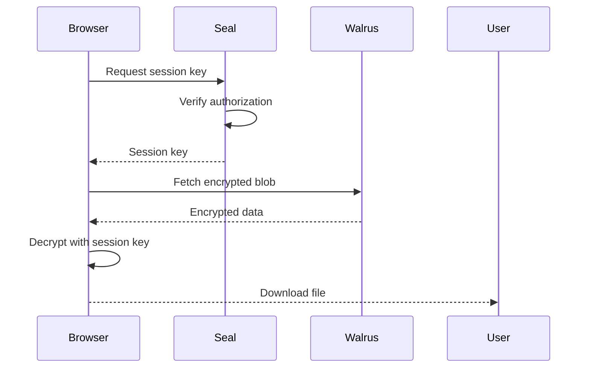

# Download & Decrypt

Access encrypted datasets you're authorized to view.

## Prerequisites

- Connected Sui wallet
- Authorization on the dataset's allowlist

## Download Process

import { Steps } from 'nextra/components'

<Steps>

### Navigate to Dataset

Go to `sealtrust.app/dataset/[id]` or find the dataset in "My Datasets".

### Check Authorization

The page will show your access status:

- **Authorized** - You can download
- **Not Authorized** - Contact the dataset owner

### Request Session Key

Click "Download & Decrypt". This will:

1. Request a session key from Seal key servers
2. You'll need to sign a transaction

> [!NOTE]
> Session keys are time-limited (10 minutes by default).

### Download

Once the session key is obtained:

1. The encrypted blob is fetched from Walrus
2. Decryption happens in your browser
3. The file downloads automatically

</Steps>

## How It Works



## Session Keys

Session keys provide temporary decryption capability:

| Property | Value |
|----------|-------|
| **TTL** | 10 minutes (default) |
| **Scope** | Single dataset |
| **Storage** | Browser memory |

## Troubleshooting

### "Not Authorized"

You're not on the dataset's allowlist. Contact the dataset owner to request access.

### "Session Key Failed"

- Ensure your wallet is connected
- Check you're on the correct network (testnet)
- Try refreshing the page

### "Download Failed"

- Check your internet connection
- The blob may have expired on Walrus
- Try again in a few moments

## Programmatic Access

```typescript
import { SealClient } from '@mysten/seal';

// Create session key
const sessionKey = await sealClient.createSessionKey({
  address: walletAddress,
  packageId: SEAL_PACKAGE_ID,
  ttlMin: 10,
});

// Fetch encrypted blob
const encryptedData = await fetch(
  `${WALRUS_AGGREGATOR}/v1/blobs/${blobId}`
).then(r => r.arrayBuffer());

// Decrypt
const decrypted = await sealClient.decrypt({
  data: new Uint8Array(encryptedData),
  sessionKey,
  txBytes,
});
```
