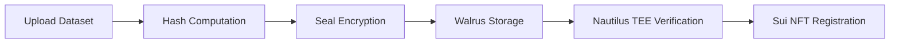

# Welcome to SealTrust

**SealTrust** is a cryptographic verification and encrypted storage platform for AI training datasets, built on the Sui blockchain ecosystem.

## What is SealTrust?

SealTrust provides a complete solution for:

- **Dataset Integrity Verification** - Cryptographic hashing ensures your data hasn't been tampered with
- **Encrypted Storage** - Seal encryption protects your datasets with fine-grained access control
- **Decentralized Storage** - Walrus provides reliable, distributed blob storage
- **TEE Attestation** - Nautilus hardware enclaves provide trusted verification
- **On-chain Registry** - Immutable records on Sui blockchain

## How It Works



1. **Hash** - Compute SHA-256 hash of your unencrypted dataset
2. **Encrypt** - Encrypt with Seal using allowlist-based access control
3. **Upload** - Store encrypted blob on Walrus decentralized storage
4. **Verify** - Nautilus TEE attests to the metadata integrity
5. **Register** - Create DatasetNFT on Sui with verification proof

## Quick Links

import { Cards } from 'nextra/components'

<Cards>
  <Cards.Card title="Getting Started" href="/getting-started" />
  <Cards.Card title="Architecture" href="/architecture" />
  <Cards.Card title="Guides" href="/guides" />
  <Cards.Card title="API Reference" href="/api-reference" />
  <Cards.Card title="FAQ" href="/faq" />
  <Cards.Card title="Roadmap" href="/roadmap" />
</Cards>

## Built With

<div style={{ display: 'flex', flexWrap: 'wrap', gap: '24px', justifyContent: 'center', margin: '24px 0' }}>
  <div style={{ display: 'flex', flexDirection: 'column', alignItems: 'center', gap: '8px', padding: '16px', borderRadius: '12px', border: '1px solid #e5e7eb', minWidth: '120px' }}>
    <span style={{ background: '#4DA2FF', padding: '8px 12px', borderRadius: '8px', display: 'flex', alignItems: 'center' }}>
      
    </span>
    <span style={{ fontWeight: 'bold' }}>Sui</span>
    <span style={{ fontSize: '12px', color: '#666', textAlign: 'center' }}>Blockchain & NFTs</span>
  </div>
  <div style={{ display: 'flex', flexDirection: 'column', alignItems: 'center', gap: '8px', padding: '16px', borderRadius: '12px', border: '1px solid #e5e7eb', minWidth: '120px' }}>
    <span style={{ background: '#fff', padding: '8px 12px', borderRadius: '8px', display: 'flex', alignItems: 'center', border: '1px solid #e5e7eb' }}>
      
    </span>
    <span style={{ fontWeight: 'bold' }}>Walrus</span>
    <span style={{ fontSize: '12px', color: '#666', textAlign: 'center' }}>Decentralized Storage</span>
  </div>
  <div style={{ display: 'flex', flexDirection: 'column', alignItems: 'center', gap: '8px', padding: '16px', borderRadius: '12px', border: '1px solid #e5e7eb', minWidth: '120px' }}>
    <span style={{ background: '#fff', padding: '8px 12px', borderRadius: '8px', display: 'flex', alignItems: 'center', border: '1px solid #e5e7eb' }}>
      
    </span>
    <span style={{ fontWeight: 'bold' }}>Seal</span>
    <span style={{ fontSize: '12px', color: '#666', textAlign: 'center' }}>Threshold Encryption</span>
  </div>
  <div style={{ display: 'flex', flexDirection: 'column', alignItems: 'center', gap: '8px', padding: '16px', borderRadius: '12px', border: '1px solid #e5e7eb', minWidth: '120px' }}>
    <span style={{ background: '#1a1a2e', padding: '8px 12px', borderRadius: '8px', display: 'flex', alignItems: 'center', fontSize: '32px' }}>🔒</span>
    <span style={{ fontWeight: 'bold' }}>Nautilus</span>
    <span style={{ fontSize: '12px', color: '#666', textAlign: 'center' }}>TEE Attestation</span>
  </div>
</div>

## Open Source

SealTrust is fully open source:

- [Frontend](https://github.com/Seal-Trust/sealtrust-frontend) - Next.js web app
- [Contracts](https://github.com/Seal-Trust/sealtrust-contracts) - Sui Move contracts
- [Enclave](https://github.com/Seal-Trust/sealtrust-enclave) - Nautilus TEE application

## Current Deployment

SealTrust is deployed on **Sui Testnet**:

```
Package ID: 0xcdc25c90e328f2905c97c01e90424395dd7b10e67769fc8f4ae62b87f1e63e4e
Enclave ID: 0x611b83f2b4d97471a6c164877ff23a2f0570806baf3d9380d1f11433a2b685ec
```
